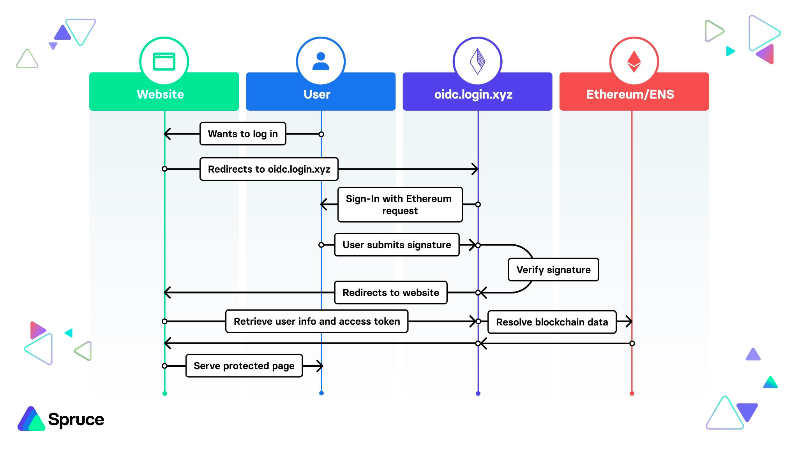
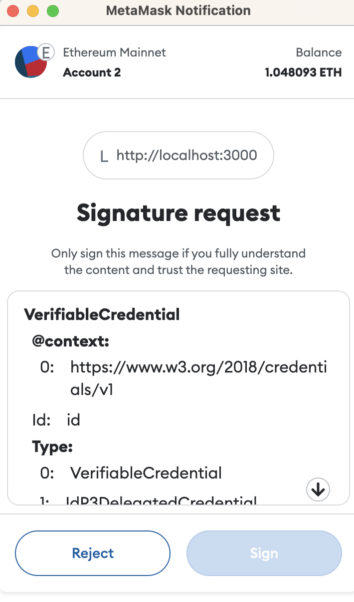

# idp3

## Description

IdP3 is a fully decentralized solution for authorization, leveraging SIOPv2 and OID4VP. This system empowers users to turn their wallets into Self-Issued ID Token Providers (SIOP) and attach credentials as Verifiable Presentations.

## Demo App

https://idp3-demo.vercel.app/

## Demo Video

TBD

## How It works

IdP3 utilize SIOPv2 and OID4VP for the new way of authorization.

### Difference from Sign In With Ethereum

Sign In With Ethereum (SIWE) requires another signing key, which is not managed by the user. It acts as a middleman in the authentication process, as illustrated in the Auth0 SIWE integration diagram below.

In contrast, the IdP3 model allows only the user to control the key for creating the ID token.

### Compatibility with W3C Verifiable Credentials

The scenario discussed below is compatible with W3C Verifiable Credentials.

https://www.w3.org/TR/vc-data-model/#subject-passes-a-verifiable-credential-to-someone-else

In our model, the Decentralized Identifier (DID) that creates the ID token is a pairwise DID. It is used only for the connection, while the original verifiable credential holder is the user's Web3 wallet.

### Verification of Verifiable Credentials from a Web3 Wallet

Web3 wallet signatures add a prefix to the message, which complicates the creation of JSON Web Tokens (JWTs). This issue presents a significant hurdle in using a Web3 wallet for authorization, and as a result, SIWE necessitates a separate signing key. However, a potential solution is currently under discussion by the Ceramic team.

https://w3c-ccg.github.io/ethereum-eip712-signature-2021-spec/

We utilize the signature verification algorithm suggested in the above link and generate verifiable presentations in the JSON-LD format.

## How It Build

IdP3 uses the Gitcoin Passport credential as its primary source of credentials. In turn, Gitcoin Passport relies on Ceramic for data storage, and Ceramic itself uses IPFS.

Additionally, IdP3 has incorporated ENS and ApeCoinDAO credentials to demonstrate a broader range of actual use cases.

Please see the details in the following documents.

- [IPFS](./docs/ipfs.md)
- [Ceramic](./docs/ceramic.md)
- [ENS](./docs/ens.md)
- [ApeCoin DAO](./docs/apecoin.md)
