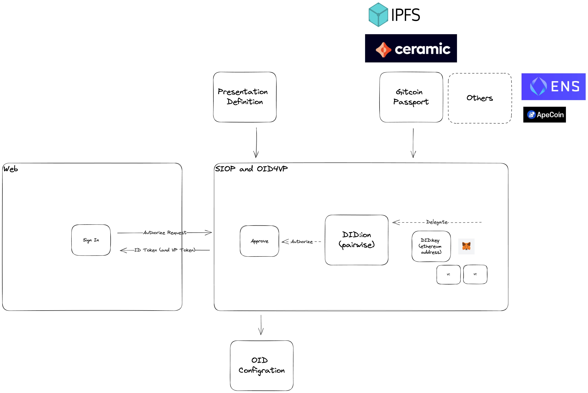

## How It Works

IdP3 uses the Gitcoin Passport credential as its primary source of credentials. In turn, Gitcoin Passport relies on Ceramic for DID based data storage, and Ceramic itself uses IPFS.

## Implementation

### Data fetch

https://github.com/block-base/idp3/blob/main/packages/app/src/app/vc/route.ts
